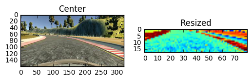
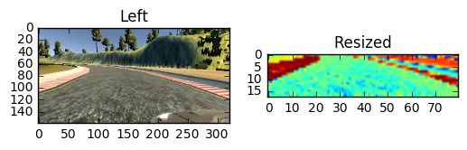
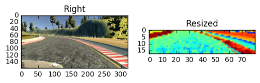

## Overview

This iPython notebook describes the function of each python script involved in the project.

---

There are **3** python scripts: **preprocess.py**, **model.py**, and **drive.py**.

## preprocess.py
This python script imports the raw image data and resizes them.

Resized the image because image contains unnecessary background noises such as sky, river, and trees.

## model.py
The main purpose of this script is to train the model using the data saved from the above python script.


## drive.py
This is the python script that receives the data from the Udacity program, predicts the steering angle using the deep learning model, and send the throttle and the predicted angles back to the program.

---

## Preprecessing

As mentioned briefly above, the images are loaded from the local drive and reshaped by the function called load_image.

Below are the original images from center, left, and right cameras and reshaped images at the right of each original image.


```python
### Import data
import argparse
import os
import csv
import base64
import numpy as np
import matplotlib.pyplot as plt

folder_path = "/Users/wonjunlee/Downloads/udacity/Self-Driving-Car-Nanodegree/CarND-BehavioralCloning-P3"
label_path = "{}/driving_log.csv".format(folder_path)

data = []
with open(label_path) as F:
    reader = csv.reader(F)
    for i in reader:
        data.append(i) 

print("data imported")
```

    data imported


```python
def load_image(data_line, j):
    img = plt.imread(data_line[j].strip())[65:135:4,0:-1:4,0]
    lis = img.flatten().tolist()
    return lis

i = 0
for j in range(3):
    plt.subplot(121)
    img = plt.imread(data[i][j].strip())
    plt.imshow(img)
    if j == 0:
        plt.title("Center")
    elif j == 1:
        plt.title("Left")
    elif j == 2:
        plt.title("Right")
    plt.subplot(122)
    a = np.array(load_image(data[i], j)).reshape(1, 18, 80, 1)
    # a = load_image(data[img_num])
    print(a.shape)
    plt.imshow(a[0,:,:,0])
    plt.title("Resized")
    plt.show()
del(a)
```

    (1, 18, 80, 1)





    (1, 18, 80, 1)





    (1, 18, 80, 1)





Total 18899 items each contained three images from different angles: center, left, and right. So, there are total 18899 x 3 = 56697 images I reshaped and used for training.


---
# Summary

I found that the whole image can confuse the model due to unncessary background noises such as tries, skies, etc. I decided to cut those unncessary pixels and reduced the size by 25%. I only used red channel of the image because I assumed that red channel contains the better information for identifying the road and lanes than green and blue channels. As a result, the size of the image was 18 x 80 x 1. 

Used 4 convolutional layers with 1 max pooling layer, and 3 more dense layers after flatten the matrix. For each convolutional layer, I decreased the channel size by half. When the size of the channel became 2 in the fourth convolutional layer, I applied max pooling with dropout with 25%. After flatten the matrix, the size of features became 360.


```python

```
